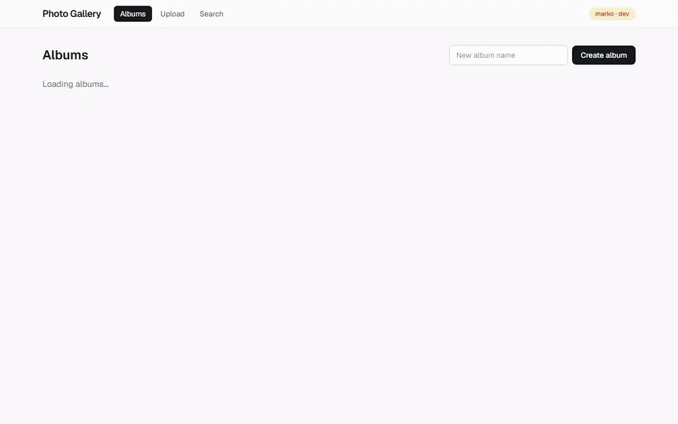
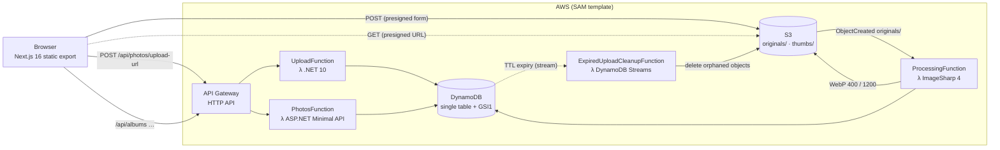
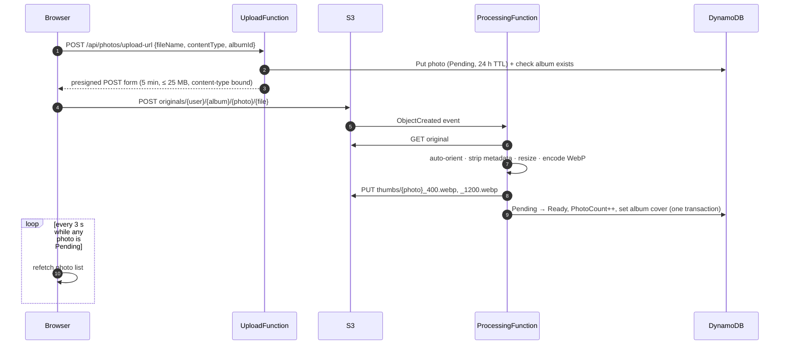
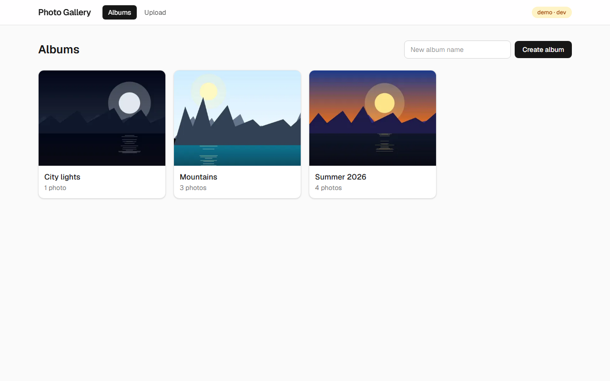
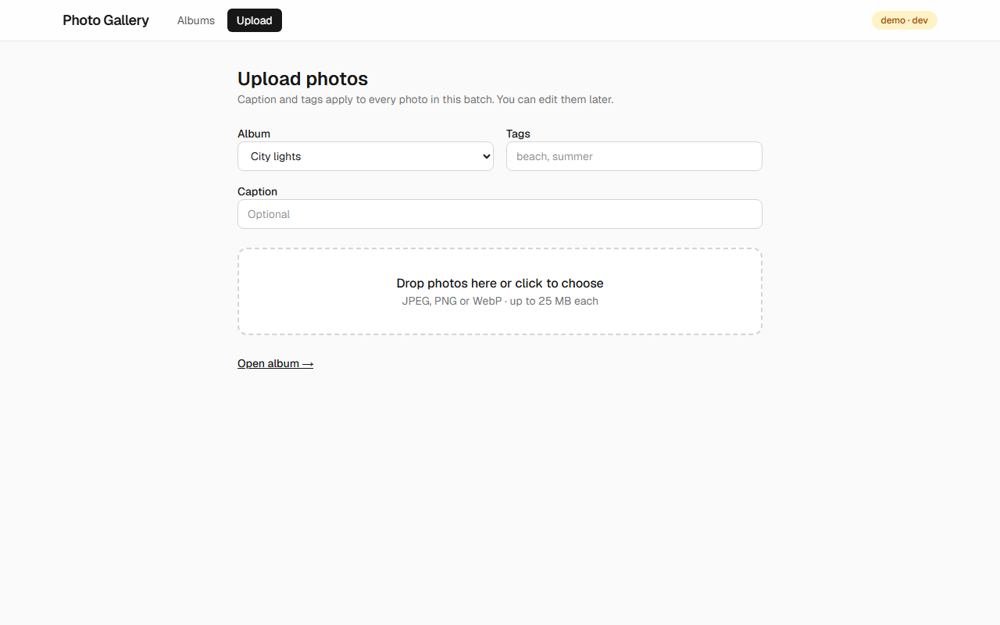
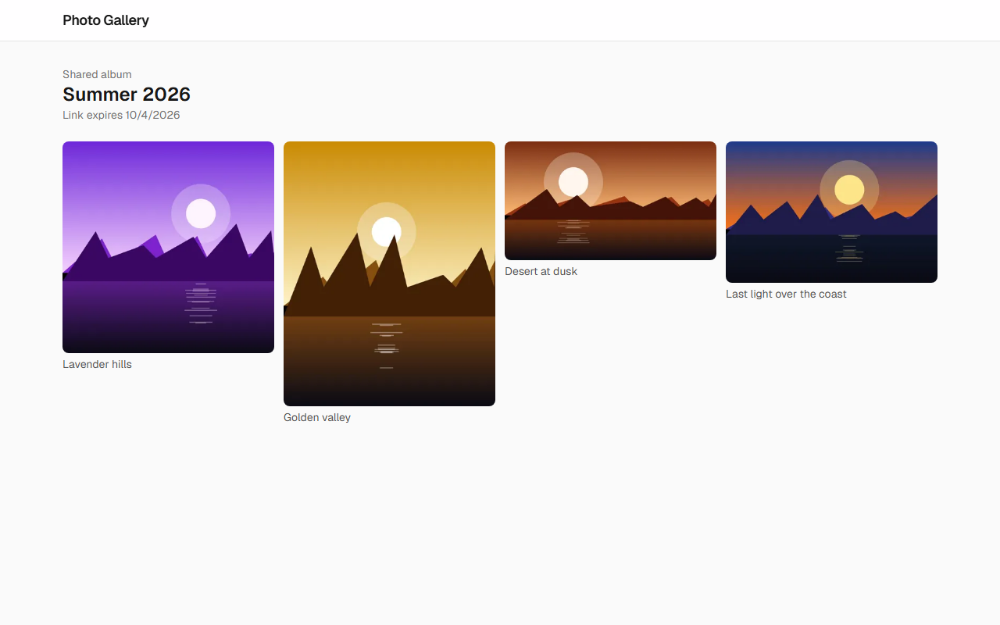

# Photo Gallery

[](https://github.com/Marokos999/photo-gallery/actions/workflows/ci.yml)
[](https://github.com/Marokos999/photo-gallery/actions/workflows/codeql.yml)


A serverless photo gallery: upload photos straight to S3, get WebP thumbnails generated automatically,
organize them in albums and share an album through an expiring public link.

Built as a portfolio project around **AWS Lambda (.NET 10)**, **ImageSharp**, **S3**, **DynamoDB single-table design**
and a **Next.js 16** static frontend — runnable end to end on a laptop with **LocalStack**.



*Recorded against the local stack (LocalStack + `sam local`); the upload part is sped up.*

## Features

- **Albums** — create, rename and delete (deleting removes every photo and its S3 objects).
- **Direct-to-S3 uploads** — drag and drop, presigned `POST` forms, per-file progress. Image bytes never pass through Lambda, and S3 itself enforces the 25 MB limit and content type.
- **Automatic processing** — every upload is auto-oriented, stripped of EXIF/GPS metadata and converted to
  400 px and 1200 px **WebP** variants.
- **Masonry grid + lightbox** — thumbnails in the grid, 1200 px previews in the lightbox.
- **Captions and tags** — set on upload or edited later; click a tag to see every photo with it.
- **Tag search** — `/search` shows a tag cloud with counts and paginated results across all albums.
- **Share links** — unguessable, expiring (1–30 days) public links that expose only processed photos; list and revoke them per album.
- **Live status** — photos show *Processing…* and update on their own when ready.

## Architecture



### Upload flow



## Tech stack

| Layer | Technology |
| --- | --- |
| Backend runtime | AWS Lambda, **.NET 10** (arm64), C# 14 |
| Photos API | ASP.NET Core **Minimal API** hosted in Lambda (`Amazon.Lambda.AspNetCoreServer.Hosting`), `TypedResults`, ProblemDetails |
| Image processing | **SixLabors.ImageSharp 4** — auto-orient, metadata stripping, WebP (q80) |
| Storage | **Amazon S3** — originals and WebP variants, presigned URLs |
| Database | **Amazon DynamoDB** — single-table design, GSI1, TTL, transactions, batch writes |
| AWS SDK | AWS SDK for .NET **v4** |
| Serialization | `System.Text.Json` **source generators** for Lambda events and API contracts (no reflection on cold start) |
| Observability | **Powertools for AWS Lambda** — structured JSON logs, CloudWatch EMF metrics, X-Ray tracing |
| Frontend | **Next.js 16** (App Router, static export), **React 19** + React Compiler, **TanStack Query 5**, **Tailwind CSS 4** |
| UI libraries | `react-dropzone`, `yet-another-react-lightbox` |
| Infrastructure as code | **AWS SAM** (`template.yaml`) |
| Local development | **LocalStack** (S3, DynamoDB, SQS), `sam local` |
| Testing | **xUnit v3** on Microsoft.Testing.Platform, `WebApplicationFactory`, LocalStack integration tests; **Vitest** + Testing Library; **Playwright** E2E |
| CI | GitHub Actions — build, tests with coverage summary, lint, formatting, E2E; **CodeQL** and **Dependabot** |

## Data model

One DynamoDB table (`PK` / `SK`) plus `GSI1`, which only indexes share links by album (photos and albums are not projected, so the bulk of writes pays for no index):

| Entity | PK | SK | GSI1PK / GSI1SK | Notes |
| --- | --- | --- | --- | --- |
| Album | `USER#{userId}` | `ALBUM#{albumId}` | — | `Name`, `PhotoCount`, `CoverPhotoKey` |
| Photo | `USER#{userId}` | `PHOTO#{albumId}#{photoId}` | — | `Status`, keys, size, caption, tags; `ExpiresAt` while pending |
| Tag pointer | `USER#{userId}` | `TAG#{tag}#{photoId}` | — | `Tag`, `AlbumId`, `PhotoId`; written in the same transaction as the photo |
| Share | `SHARE#{code}` | `SHARE` | `ALBUM#{albumId}` / `SHARE#{code}` | `OwnerUserId`, `AlbumId`, `ExpiresAt` (TTL) |

IDs are **UUIDv7** (`Guid.CreateVersion7`) — time-sortable, so sort keys come back in creation order.

## API

| Method | Route | Auth | Description |
| --- | --- | --- | --- |
| `POST` | `/api/photos/upload-url` | ✅ | Validate, create a pending photo, return a presigned `POST` form |
| `GET` | `/api/albums` | ✅ | List albums with presigned cover URLs |
| `POST` | `/api/albums` | ✅ | Create an album |
| `GET` | `/api/albums/{albumId}` | ✅ | Get one album |
| `PATCH` | `/api/albums/{albumId}` | ✅ | Rename |
| `DELETE` | `/api/albums/{albumId}` | ✅ | Delete the album, its photos and all S3 objects |
| `GET` | `/api/albums/{albumId}/photos?limit=&cursor=` | ✅ | One page of photos (newest first) with presigned thumbnail/preview URLs |
| `PATCH` | `/api/albums/{albumId}/photos/{photoId}` | ✅ | Update caption and tags |
| `DELETE` | `/api/albums/{albumId}/photos/{photoId}` | ✅ | Delete a photo and its S3 objects |
| `POST` | `/api/albums/{albumId}/share` | ✅ | Create a share link (default 7 days, max 30) |
| `GET` | `/api/albums/{albumId}/shares` | ✅ | List the album's share links |
| `DELETE` | `/api/shares/{code}` | ✅ | Revoke a share link |
| `GET` | `/api/photos?tag=&limit=&cursor=` | ✅ | Ready photos with a tag, across albums (newest first) |
| `GET` | `/api/tags` | ✅ | The user's tags with photo counts |
| `GET` | `/api/shared/{code}` | ❌ | Public album view — ready photos only, no owner data |

Another user's album always returns **404**, never 403, so album IDs cannot be probed.

## Project structure

```
photo-gallery/
├── src/
│   ├── PhotoGallery.Core/          # models, keys, DynamoDB repository, S3 signing/storage
│   ├── PhotoGallery.Upload/        # UploadFunction — presigned POST forms
│   ├── PhotoGallery.Processing/    # ProcessingFunction (ImageSharp → WebP) + expired-upload cleanup
│   └── PhotoGallery.Photos/        # PhotosFunction — ASP.NET Minimal API
├── tests/PhotoGallery.Tests/       # unit, API (WebApplicationFactory) and LocalStack integration tests
├── tools/PhotoGallery.LocalProcessor/  # local stand-in for the S3 → Lambda trigger
├── frontend/                       # Next.js 16 static site
├── infra/localstack/               # LocalStack init script (bucket, table, queue) and seed data
├── docs/                           # ADRs, demo GIF and screenshots
├── template.yaml                   # AWS SAM template
└── docker-compose.yml              # LocalStack
```

## Running locally

### Prerequisites

- [.NET 10 SDK](https://dotnet.microsoft.com/download), [Node.js 24](https://nodejs.org), [Docker Desktop](https://www.docker.com/products/docker-desktop/)
- [AWS SAM CLI](https://docs.aws.amazon.com/serverless-application-model/latest/developerguide/install-sam-cli.html)
- A free [LocalStack](https://app.localstack.cloud) account (auth token)
- An [ImageSharp license](https://sixlabors.com/pricing/) — free community licenses are available for open-source projects

### Setup

```bash
cp .env.example .env                    # add your LOCALSTACK_AUTH_TOKEN
cp frontend/.env.example frontend/.env.local
# put sixlabors.lic in the repository root (git-ignored)
npm install --prefix frontend
```

### Start

Each command in its own terminal:

```bash
docker compose up -d                                                         # LocalStack: S3, DynamoDB, SQS
dotnet run --project src/PhotoGallery.Photos --launch-profile local          # Photos API     → :5201
sam build && sam local start-api --port 3001                                 # Upload Lambda  → :3001
dotnet run --project tools/PhotoGallery.LocalProcessor --launch-profile local  # processes uploads
npm run dev --prefix frontend                                                # frontend       → :3000
```

Open <http://localhost:3000>.

> **How processing works locally:** `sam local` cannot receive S3 events, so LocalStack sends `ObjectCreated`
> notifications to an SQS queue and `tools/PhotoGallery.LocalProcessor` hands them to the real `ProcessingFunction`.
> On AWS the S3 bucket triggers the Lambda directly.

> **Authentication:** the SAM template is ready for an API Gateway JWT authorizer (the API reads the `sub` claim).
> Locally there is no identity provider, so the `x-debug-user-id` header identifies the user — it is only honoured
> when the services run against LocalStack.

## Tests

```bash
dotnet test                        # 122 tests; integration tests run when LocalStack is up, otherwise they are skipped
dotnet test --coverage --coverage-output-format cobertura --coverage-settings tests/CodeCoverage.config.xml

npm test --prefix frontend          # Vitest: lib and component tests (jsdom)
npm run build --prefix frontend
npm run test:e2e --prefix frontend  # Playwright smoke tests against the static export, API mocked
npm run lint --prefix frontend
npm run format:check --prefix frontend
```

The Playwright suite serves the real `out/` export and fakes the API per test with `page.route`, so it needs
no AWS, LocalStack or backend process. Run `npx playwright install chromium` once before the first run.

### Observability

Every Lambda uses Powertools: JSON logs carry the request id, cold start and (in AWS) the X-Ray trace id;
custom metrics in the `PhotoGallery` namespace — `UploadUrlsIssued`, `PhotosProcessed`, `PhotosFailed`,
`OriginalBytes`, `ExpiredUploadsCleaned` and `ColdStart` — are written as CloudWatch EMF, so they need no
extra API calls. X-Ray instrumentation of the AWS SDK is switched off under LocalStack and `sam local`.

## Design decisions

The larger decisions are written up as [Architecture Decision Records](docs/adr/README.md)
(serverless on Lambda, presigned POST, single-table DynamoDB, async processing, static frontend, identity, observability).

| Decision | Why |
| --- | --- |
| **Presigned POST, direct browser → S3** | Lambda never handles image bytes: no API Gateway 10 MB limit, no Lambda timeout risk, cheaper. The POST policy makes S3 reject files over 25 MB or with another content type — a presigned PUT cannot limit size. |
| **Stable download URLs** | Presigned URLs embed the signing time, so re-signing on every poll would make the browser re-download every thumbnail. URLs are reused per object for 45 minutes. |
| **Cursor pagination** | Albums load 60 photos at a time (infinite scroll); the cursor is the last sort key, validated against the album. |
| **Pixel limit before decoding** | `Image.Identify` reads only the header and rejects images over 50 MP, so a small "decompression bomb" file cannot exhaust Lambda memory. |
| **S3 event → processing Lambda** | Uploading returns immediately; thumbnails are generated asynchronously while the UI polls. |
| **Idempotent processing** | S3 delivers events *at least once*. A conditional `Pending → Ready` transaction guarantees a photo is counted once, and duplicate events skip the download entirely. |
| **Pending photos expire (TTL) + Streams cleanup** | A photo record is created before the upload. If it is never processed, DynamoDB TTL removes it after 24 h and a DynamoDB Streams consumer (filtered to TTL deletions only) deletes whatever reached S3 — no orphaned objects. |
| **One rule set, two entry points** | Caption/tag normalization and the caller-identity rule live in Core and are shared by the upload Lambda and the Photos API. |
| **Count on ready, not on upload** | `PhotoCount` only includes processed photos, so abandoned uploads never inflate it. |
| **Auto-orient before stripping EXIF** | Phones store rotation in EXIF. Removing EXIF first would leave portraits sideways; GPS data is removed for privacy. |
| **WebP variants** | Roughly 25–35 % smaller than JPEG at similar quality — less storage and transfer. |
| **Single-table DynamoDB** | Every screen is one query (`PK = USER#…`, `begins_with(SK, …)`); shares have their own key so a public link resolves with one `GetItem`. |
| **Database first, then S3 on delete** | A failed S3 delete only leaves an invisible orphan; the reverse order could show broken images. |
| **Static Next.js export** | No server to run; query-string routes (`/album?id=…`) because album IDs are unknown at build time. |

## Screenshots

| Albums | Upload | Public share link |
| --- | --- | --- |
|  |  |  |

*Screenshots use generated demo images.*

## Deployment

`template.yaml` describes the full AWS stack: S3 bucket with the processing trigger, DynamoDB table with TTL and
Streams, a Cognito user pool, the HTTP API with a **JWT authorizer** (share links and health stay public) and the four
functions on `dotnet10` / arm64 with X-Ray tracing.

```bash
sam build
sam deploy --guided --parameter-overrides AllowedOrigin=https://gallery.example.com
```

| Parameter | Default | Purpose |
| --- | --- | --- |
| `AllowedOrigin` | `http://localhost:3000` | Frontend origin for API Gateway, Photos API and S3 CORS |

Outputs: `ApiUrl` (for `NEXT_PUBLIC_API_URL` / `NEXT_PUBLIC_UPLOAD_URL`), `UserPoolId`, `UserPoolClientId`.

The project is run locally; for a public deployment the frontend still needs a sign-in flow (Cognito hosted UI or
Amplify Auth) that sends `Authorization: Bearer <token>`, and the static `out/` folder hosted on S3 + CloudFront.

## License

[MIT](LICENSE) © Marko Jovanović
